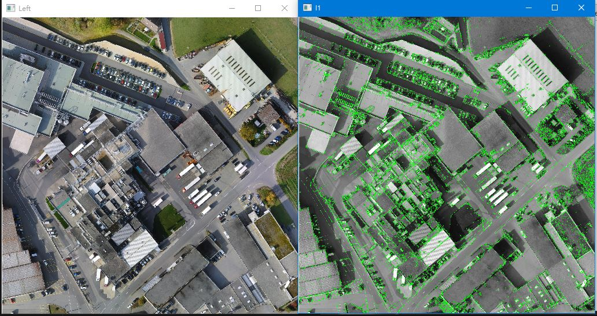

UI介面

Q1-Corner Detection(use opencv function to do this)

Q2-Augmented Reality( use opencv function to read and derive the matrix of the char)

Q3-Stereo Disparity Map(Use OpenCV StereoB class to build StereoBM objects)

Q4-Keypoints(Based on SIFT algorithm find keypoints on picture)

Q5-classify animals(training VGG19 to classify animals)

